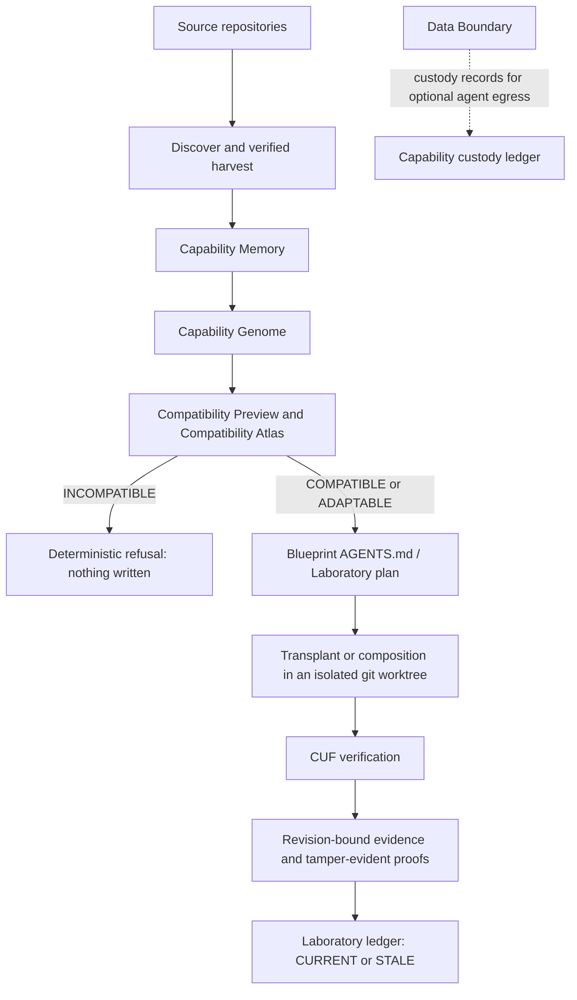

# GRAFT

**Find it. Fit it. Prove it.**

AI made writing software cheap. Trusting it is still expensive. GRAFT is the trust, reuse and verification layer for AI-assisted software development: it finds capabilities you already built, determines whether they fit another project, and verifies the resulting behaviour with evidence bound to the exact revision. It can refuse unsafe reuse, and its evidence expires when the code changes.

- **Live demo (4:32, the packaged app operated in real time):** [GRAFT 0.6 live demo](https://youtu.be/9c-u03Tj62Y)
- **Hosted judge experience:** <https://judge-topaz.vercel.app>
- **Download (macOS Apple Silicon):** [GRAFT-0.6.0-galuxium-arm64.dmg](https://graft-beta-downloads.fly.storage.tigris.dev/GRAFT-0.6.0-galuxium-arm64.dmg), `167,317,360` bytes, SHA-256 `bb6e0e05501b595da72096f3a9d57de53c040495fed45117f0bf868876923ee1`. It is ad-hoc signed and not Apple notarized; see [docs/GALUXIUM-ARTIFACT.md](docs/GALUXIUM-ARTIFACT.md).
- **Judging evidence, claim by claim:** [docs/GALUXIUM-RUBRIC-EVIDENCE.md](docs/GALUXIUM-RUBRIC-EVIDENCE.md)
- **Build provenance and repository history:** [docs/GALUXIUM-BUILD-EVIDENCE.md](docs/GALUXIUM-BUILD-EVIDENCE.md)
- **Five-minute path:** in the demo, COMPOSITION VERIFIED is at 1:51, the same evidence turning STALE after a later commit at 2:26, and an INCOMPATIBLE refusal with Apply disabled at 3:32. The judge site's evidence explorer shows the recorded run step by step.

## The problem

Generation has outrun verification. In the [2025 Stack Overflow Developer Survey](https://survey.stackoverflow.co/2025/ai), 84% of respondents use or plan to use AI tools in their development process, yet more developers distrust the accuracy of AI output (46%) than trust it (33%); the most common frustration, at 66%, is "AI solutions that are almost right, but not quite", and 45.2% say debugging AI-generated code is more time-consuming.

Reusing a capability across real repositories still requires a developer to establish:

- what an existing implementation actually does;
- whether its evidence is trustworthy;
- whether it fits the destination;
- what adaptation is necessary;
- whether the transplanted behaviour still works afterwards.

GRAFT turns software capability reuse into a verifiable engineering process.

**One market, two entry points.** AI has expanded the population able to build substantial software: AI-first builders create applications rapidly with coding agents, while their tooling for trustworthy reuse and verification has lagged behind their tooling for generation. GRAFT gives that workflow memory, compatibility analysis, deterministic refusal, provenance and verification. Professional developers and engineering organisations have the same problem at greater scale: years of working implementations and internal patterns are rediscovered or rebuilt across repositories. GRAFT turns that accumulated work into reusable, evidence-backed capabilities. More people, more agents and more generated software mean a greater need for trustworthy reuse and verification.

**GRAFT is not another coding agent.** Coding agents primarily create or modify software. GRAFT discovers existing capabilities, determines whether they can safely fit another environment, and produces revision-bound evidence that the result works. It is complementary infrastructure for agentic development: Claude, Codex and other agents can act as interchangeable reasoning or execution layers, for example by following a Blueprint, while capability knowledge, compatibility reasoning, provenance and verification evidence stay with GRAFT. GRAFT does not depend on any model vendor, and the demonstrated workflow uses no AI provider. No comparison against any coding agent is claimed.

**Two ideas a judge should take away.**
- *Deterministic refusal.* Most AI development systems optimise for completing the requested action. GRAFT returns COMPATIBLE, ADAPTABLE or INCOMPATIBLE before anything is written, and refuses reuse when compatibility or evidence requirements cannot be met.
- *Evidence that expires.* A green checkmark is not permanent evidence. Every verdict is bound to one revision: CURRENT at that revision, STALE after the next commit. Change the code and GRAFT demands new proof.

## Find

- **Authorised workspace.** GRAFT scans only folders you add. **Choose software folder** authorises a root and indexes the projects, repositories and capabilities inside it.
- **Discovery with evidence.** Search is deterministic. **Why GRAFT thinks this** lists the exact signals and files behind every detection.
- **Verified harvest.** Harvesting runs the source project, after explicit trust approval, and executes the capability's acceptance cases over HTTP, or against the library artifact. It saves the capability only if every required case passes. Hosted sign-in is verified against a deterministic stand-in identity provider, never a live one.
- **Capability Memory.** Verified records are stored locally and bound to the source revision and content. Nothing is uploaded.

## Fit

- **Compatibility Preview.** Before any write, GRAFT classifies a destination as **COMPATIBLE**, **ADAPTABLE** (it can proceed only with the listed adaptation or an explicit conflict resolution) or **INCOMPATIBLE**.
- **Deterministic refusal.** An INCOMPATIBLE plan is refused before adaptation or execution: Apply is disabled and the API refuses with no mutation.
- **Blueprint.** A deterministic `AGENTS.md` handoff that states the objective, provenance, required constraints and verification for a compatible coding agent.
- **Laboratory.** Composes capabilities under explicit dependency, conflict and evidence checks (see below).

## Prove

- **Verification.** Each capability's own contract runs against the running destination: required behavioural cases, counterfactuals, and host-preservation checks where applicable. Optional witnesses (for example, session durability across a restart) are reported separately and never counted as required passes.
- **Revision binding.** A verdict belongs to one destination revision. In the Laboratory ledger a record is **CURRENT** only at that revision; a later commit makes it **STALE**.
- **Receipts, proofs and provenance.** Transplants write a recovery receipt. Proofs are tamper-evident files whose integrity is checked separately from the verdict, and they can be exported and verified offline (`graft proof verify`). Provenance traces source revision → destination revision → proof identifiers.

## Architecture



GRAFT runs on your machine as a Node.js CLI, a local browser workspace (bound to `127.0.0.1`) and an Electron desktop app. The package layout:

| Package | Contents |
| --- | --- |
| `packages/core` | Discovery, harvest, manifests, the engine (Genome, graph, IR, verification contract, Atlas), planning, emitters, apply, verification, Laboratory, Data Boundary |
| `packages/cli` | The `graft` command |
| `packages/web` | The local workspace server and client, plus the static judge site in `packages/web/judge` |
| `packages/desktop` | The Electron shell and packaging |
| `packages/cuf-kernel` | The vendored CUF proof kernel (see `packages/cuf-kernel/PROVENANCE.json`) |
| `packages/proof-adapter` | The adapter between GRAFT runs and the CUF kernel, and portable proof files |
| `packages/licensing` | The licensing and purchase service |
| `fixtures/`, `bench/` | The bundled demo projects and the public benchmark harness |

## Laboratory

The Laboratory composes capabilities under explicit compatibility and evidence constraints and verifies the resulting composition. It is not autonomous software generation.

1. A blueprint lists goals.
2. GRAFT offers saved capabilities for each goal, with their evidence, dependencies and conflicts.
3. The assembly plan names the host and every ordered step. An unsupported host is Blocked before anything is created.
4. Assembly creates a new local application with no remote. It adds each capability in an isolated worktree and verifies it with its own contract. It re-verifies earlier capabilities after later ones are added, then checks that the host still behaves as before.
5. **COMPOSITION VERIFIED** is reported only when every capability passes on one final revision. There is no combined score.
6. **Finalize** fast-forwards your project only after re-checking; nothing is pushed.

## Capability Memory

Capability Memory is local and private by default, under `GRAFT_HOME` (default `~/.graft`). Each record is bound to the source revision it was verified at, so evidence always refers to an exact state of the source.

## Capability Genome

The Genome is the structured internal representation of a harvested capability. It is derived deterministically from the capability package and nothing else, so it can be rebuilt and checked at any time. It covers entrypoints, inputs, outputs, side effects, dependencies, data, runtime assumptions, security properties, and the contract that proves it. Each part traces back to a manifest section. The genome ID hashes behavioural content only, so timestamps and paths never change it.

## Compatibility Atlas

The Atlas is the local record of what GRAFT observes across attempts:
- the source and destination architecture fingerprints;
- the adaptations attempted;
- the outcome and verification result;
- the evidence digests that tie each entry to its proof.

It informs a plan's risk notes, but never changes a compatibility check or a verdict. Compatibility decisions themselves are deterministic rules over the Host Model.

The public `bench/` harness measures planning quality. A separate protected perturbation benchmark, whose answer keys are withheld (see *Public repository scope*), guards against tuning to known answers.

## Blueprint

The **Export AGENTS.md handoff** action (`plan/agents-export`) writes a deterministic AGENTS.md into the destination's isolated worktree. It never overwrites an existing file; if one exists, it writes an alternate file with merge guidance instead. The handoff states what an agent must do, what it must not change, and how the result will be verified.

## CUF verification

`packages/cuf-kernel` is the vendored CUF proof kernel: compiled output of CUF, the developer's own proprietary verification project, at a recorded commit, with one documented specifier rewrite. CUF's TypeScript source is not in this repository; see [docs/GALUXIUM-BUILD-EVIDENCE.md](docs/GALUXIUM-BUILD-EVIDENCE.md). It is authoritative for:
- each case's PASS, FAIL or INCONCLUSIVE verdict, from the declared expectations and the observations;
- aggregating those into the run verdict (FAIL outranks INCONCLUSIVE outranks PASS);
- evidence normalisation;
- the proof root.

`packages/proof-adapter` is the only module that speaks both vocabularies. GRAFT owns the contracts, the drivers and the observations.

## Data Boundary

GRAFT is local and private by default. Before any optional external provider operation:
- the request is classified into a data class: `NONE`, `METADATA`, `STRUCTURE`, `SOURCE_EXCERPT` or `GENERATED_DERIVATIVE`;
- a policy decides ALLOW or DENY;
- a custody record stores the decision, the policy and an input fingerprint in `capability-custody.json`.

Custody records never retain raw prompts, source excerpts or credentials, and secret-like content is denied.

## Local state (no hosted database)

GRAFT uses local files rather than a database. Under `GRAFT_HOME`:

| Path | Contents |
| --- | --- |
| `registry.json` | Registered projects |
| `organ-bank/<slug>.graft/` | Capability packages: manifest, capability contract, source verification, provenance, engine artifacts |
| `capability-memory.json`, `workspace-index.json` | Capability Memory and the workspace index |
| `atlas/` | Compatibility Atlas entries |
| `laboratory/` | Blueprints, plans, executions and the `assemblies/` ledger |
| `proofs/` | Tamper-evident proof files, named by digest |
| `capability-custody.json` | The Data Boundary custody ledger |
| `worktrees/` | Isolated transplant and assembly worktrees |

Writes use locks and atomic replacement; recovery is described below.

## Security and privacy

- Local-first: repository-sensitive discovery, adaptation and verification run on your machine. The hosted judge site is a static, sanitized replay with no executor or upload endpoint.
- An explicit Data Boundary applies before any external provider operation.
- Capability packages record configuration names only, never values.
- Incompatible or unsafe plans are refused before any write.
- Provenance and revision-bound proofs make every claim auditable.
- Verification executes project code with your permissions and is not a sandbox; see [SECURITY.md](SECURITY.md).

## Quick start

Requires Node.js 20 or newer and Git. macOS and Linux are the supported release targets; Windows process-tree cleanup is not supported to the same level.

```sh
npm ci --ignore-scripts
npm start
```

Open **http://127.0.0.1:4317**. The workspace lets you add projects, inspect discovered capabilities, harvest verified authentication, review complete generated files and before/after entrypoint edits, apply a transplant, and inspect HTTP test results. Click **Create sample workspace** to try it with two isolated copies of the bundled projects. These sample repositories remain under `GRAFT_HOME` for inspection.

Choose **Projects → Explore → Harvest** for the source, then **Organ bank → Plan transplant** for a destination. A clean, committed destination and explicit approval of conflicting route changes are required. The final action asks you to approve the reviewed changes and trusted code execution. Every displayed verdict comes from the engine's observed results.

Alternatively, `npm run demo` runs the same underlying workflow in the terminal on temporary repositories.

To install a distributable CLI from this checkout:

```sh
npm pack
npm install --global ./graft-0.6.0.tgz
graft ui
```

The tarball includes the browser workspace, CLI, core, and demo fixtures. It works outside this checkout. Use `graft ui --port 4318` (or `GRAFT_UI_PORT=4318 npm start`) if the default port is in use. Public registry publishing remains disabled with `private: true`.

The dashboard binds only to `127.0.0.1`; it is a local application, not a cloud service. Leave its process running while using it. Refresh the page after a server restart to establish a new session. Closing the server with Ctrl+C waits for the active operation to finish. Initial transplant test results are saved in recovery receipts; later re-verification runs and other session activity remain in memory. Projects, the organ bank, and transplant history persist across restarts. Do not expose this server through a proxy or tunnel.

## Desktop application

An Apple Silicon macOS build packages the same workspace and engine with a bundled Node runtime, so it needs no Node installation of its own. Build it with `npm run desktop:make` and verify a build with `npm run desktop:package -- --fixture` followed by `npm run desktop:accept`. Normal production candidates remain unconfigured and fail closed. The separately named Galuxium judge build uses the existing deterministic local demo provider and needs no external activation; it does not alter production or private-beta licensing. See [docs/GALUXIUM-ARTIFACT.md](docs/GALUXIUM-ARTIFACT.md) for the judge build; [docs/DESKTOP-0.5.md](docs/DESKTOP-0.5.md) is the historical 0.5 distribution record.

GRAFT's purchase and licensing backend lives in `packages/licensing`: one product at $49 one-time through Stripe Checkout, with Stripe as merchant of record (Stripe Managed Payments handles tax). The desktop app never holds a Stripe secret; payment is verified server-side. The Galuxium Stripe configuration is test mode and not yet live end to end. See [packages/licensing/README.md](packages/licensing/README.md).

## Use your projects

```sh
graft add /path/to/old-project
graft add /path/to/new-project
graft harvest old-project
graft harvest old-project --capability authentication
graft bank
graft plan authentication --to new-project --json graft-plan.json
graft transplant authentication --to new-project --dry-run
graft transplant authentication --to new-project
graft verify authentication --in new-project
```

Use a committed, clean destination repository. Review the plan first. If routes collide, inspect the listed conflicts and explicitly supply `--resolve-conflicts` to comment out the complete old registrations. Unrecognized options and missing values are errors; a failed or inconclusive verification exits nonzero. `graft plan` also exits nonzero for blocked or unresolved plans.

`harvest` without `--capability` only discovers candidates. Harvesting a selected capability starts and tests the source by default. `--no-verify-source` skips execution and records the result as unproven. `--bank-unverified` retains a failing source manifest for inspection; it cannot be transplanted.

**Verification executes project code with your operating-system privileges.** Only run projects you trust. The controlled child environment, timeouts, and process-group cleanup are not an operating-system sandbox. See [SECURITY.md](SECURITY.md).

## Supported shapes

| Area | GRAFT 0.6 support |
| --- | --- |
| Capabilities | Hosted sign-in (session auth backed by an identity provider) as a service; email/password session auth (scrypt, opaque cookie sessions) as a service; feature flags as a library (SwivelJS-style adaptation) |
| Destinations | A new bare `node:http` application (the Laboratory target); custom ESM `node:http` hosts; direct-route ESM Express (`express-req-res`, exercised against Express 5.2.1) for session-auth transplants |
| Experimental | Express ESM hosts for hosted sign-in; the repair loop; compatibility learning across your own transplants |
| Not yet | CommonJS destinations; non-Node stacks, Next.js, NestJS, Fastify, Koa; other capability kinds; Windows and Intel Macs; capabilities that need a live third-party provider to verify |

The Express profile supports one default Express import, one application, direct static routes, and inline/body-parser middleware. GRAFT preserves surrounding middleware and trailing 404 handling. Unsupported wiring is reported before writes. Generated files are new implementations of the manifest contract, not copied source files.

The runtime starts `node -- <entrypoint>` and requires the application to listen on `process.env.PORT`. Install the project's own dependencies before verification. GRAFT neither installs destination dependencies nor loads its `.env` credentials.

## What VERIFIED means

- `VERIFIED`: every required acceptance test passed against the running application.
- `FAILED`: a required assertion failed.
- `NEEDS_REVIEW`: behavior could not be established, for example because the app did not start or a request timed out.

Empty/unsupported assertions, missing required evidence, duplicate test IDs, inconsistent source summaries, and invalid imported manifests are refused. Reports redact recognized secret patterns and cap captured output and response sizes. Source provenance is an auditable local record, not a cryptographic attestation; rerun verification for manifests from another party.

Passing these tests establishes the specified behavior. It is not a production security assessment of the generated authentication system. In-memory users/sessions do not survive restart. Production adoption requires an appropriate persistent store, HTTPS/cookie policy, abuse controls, and application-specific security review. OAuth, MFA, password reset, email verification, and AI-provider integration are not included.

## Local state and recovery

Projects and harvested packages live in `~/.graft`, or the directory named by `GRAFT_HOME`. Registry updates use a lock and atomic file replacement. Corrupt registry files are preserved and reported; restore or repair them before retrying. A stale `registry.lock` may be removed only after confirming no GRAFT command is running.

Organ-bank updates stage and validate a complete replacement, hold a per-package lock, and keep the previous directory until the new package is installed. Failed writes restore the previous package; a reader never accepts sections mixed across generations. A re-harvest also removes obsolete source-verification evidence. Extra files you added to a package cause a refusal rather than being deleted.

### Recover an interrupted organ-bank update

A crashed writer leaves `.<slug>.graft.lock` beside the package. `graft bank` reports it even if the main directory is temporarily absent. The lock records the writer PID, target, and previous-package path. Confirm that the writer has stopped before recovery; a PID alone is not proof of ownership because operating systems reuse PIDs.

1. Back up the target, `.<slug>.graft.previous`, matching `.<slug>.graft-stage-*` directories, and the lock outside the organ bank before changing anything.
2. If `<slug>.graft` exists, keep it. If it is absent and `.<slug>.graft.previous` exists, rename that previous directory back to `<slug>.graft`. If neither exists, keep the backup and re-harvest after cleanup.
3. Move leftover staging/previous directories out of the bank, then remove the stale lock. Run `graft bank` to validate the recovered package; re-harvest if it is unreadable. Keep the external backup until satisfied.

The process-crash and ordinary I/O failure paths are tested. This is not a guarantee against filesystem corruption or whole-machine power loss. Reads require no writable lock file, so completed packages can still be read from a read-only bank. Concurrent edits outside GRAFT's lock remain unsupported.

Transplants create a `graft/<capability>-<id>` branch and `.graft/transplants/<plan-id>.json` receipt. The receipt records the previous branch/HEAD, written files, original entrypoint, and applied edits. **The original entrypoint may contain sensitive project code; keep receipts private.**

To undo a transplant, stop the destination, inspect the receipt, restore the entrypoint from `recovery.entrypointBefore`, and remove only the generated paths in `filesWritten`. Preserve any changes you made after the transplant. Then return to `recovery.branchBefore` (or `recovery.headBefore` for a detached HEAD). Switching branches alone does not undo uncommitted changes. Save or remove the receipt after reviewing it.

GRAFT preflights all output, entrypoint, and receipt paths, refuses symbolic/hard links and traversal, and exclusively creates new files. A write failure removes files created by that attempt and restores the entrypoint; the temporary recovery branch may remain selected. Avoid concurrent edits to the destination during apply. Safety override flags are documented in `graft transplant --help`.

## Development and release checks

```sh
npm run check          # parse-check every JavaScript file
npm test               # unit, mutation, filesystem, process, CLI, and dashboard integration tests
npm run test:web       # dashboard security and real workflow tests
npm run test:package   # pack, install elsewhere, run the CLI demo and browser server
npm run release:check  # all of the above
npm audit --omit=dev
node scripts/demo/judge-preview.mjs    # serve the static judge site at http://127.0.0.1:4173
node scripts/demo/judge-evidence.mjs   # regenerate the judge evidence from the bundled fixtures
node scripts/publication-check.mjs     # public-repository exclusion, secret and personal-path scan
```

CI is configured for Node 20, 22, and 24 on Linux and macOS. Local test results do not establish that the remote matrix has passed. [RELEASE.md](RELEASE.md) records the exact local release assessment, and [docs/GALUXIUM-BUILD-EVIDENCE.md](docs/GALUXIUM-BUILD-EVIDENCE.md) records the factual Galuxium build-window evidence.

## Limitations

- Capability kinds and hosts are deliberately narrow; see *Supported shapes*.
- Optional agent features (design help, plan explanation, agent-interpreted search) need a provider you configure; keys are read from the environment and never stored.
- Hosted sign-in is verified against a deterministic stand-in identity provider, not a live one.
- The accepted macOS build is ad-hoc signed and not notarized. In the packaged judge build, **Create sample workspace** fails because the fixtures are not bundled; use your own folders, or run from source, where it works.
- The protected compatibility benchmark's answer keys are intentionally not published.

## Public repository scope

**Product source (public).** All code needed to inspect, build, test and run the submitted GRAFT 0.6 product and judge site:
- the GRAFT packages listed above, in source form;
- the vendored verification kernel (`packages/cuf-kernel`), as compiled JavaScript with its provenance record;
- the fixtures, the public benchmark harness and tests;
- the build, packaging and evidence-generation scripts.

**Intentionally excluded (private operational or protected material).** None of these is needed to build or run the submitted judge application:
- The protected compatibility perturbation benchmark (`bench/compatibility-perturbations.mjs`) and its test, which contain answer keys.
- Private-beta distribution configuration and tooling (`packages/desktop/config/product.private-beta.json`, `scripts/private-beta.mjs`).
- Licensing-service deployment configuration (`packages/licensing/fly.toml`, `packages/licensing/DEPLOY.md`).
- Credentials of any kind.
- Internal development checkpoints and handoff notes.

`scripts/publication-check.mjs` enforces these exclusions and scans for secrets and personal paths.

This repository has a short, curated publication history. The incremental development history is private and is summarised in [docs/GALUXIUM-BUILD-EVIDENCE.md](docs/GALUXIUM-BUILD-EVIDENCE.md).

## Business model

**Implemented and tested.** The licensing service (`packages/licensing`) for a $49 USD one-time desktop licence: Stripe Checkout with Managed Payments requested (Stripe acts as merchant of record), a `/buy` redirect to a Stripe Payment Link, signature-verified webhook fulfilment, and server-side purchase verification that re-fetches the Checkout Session before any licence is issued. A success redirect alone never issues a licence. Covered by 110 automated tests against a Stripe fake. The desktop app never holds a Stripe secret.

**Configured, not live end to end.** A Stripe test-mode product, price, Payment Link and webhook exist. The licensing service that fulfils them is not yet deployed, and no purchase has been completed through it. Sandbox transactions are test data, not revenue.

**Proposed, not built.** No revenue, customers or usage figures are claimed.
- **Free / Local:** local capability reuse, Capability Memory and the core compatibility and verification workflow for individual developers.
- **Pro:** paid professional workflow features for individuals (proposed pricing).
- **Team:** a proposed recurring per-seat subscription for shared verified-capability registries, organisational capability distribution, policy, audit retention and team compatibility intelligence.
- **Enterprise:** a proposed annual contract for private capability infrastructure, identity and access controls, governance, longer audit retention, and managed deployment and support.

Recurring revenue would come from the shared, governed registry. Its value grows with every verified capability a team adds.

## Future benchmark work

A planned, protected comparison of raw repository access against GRAFT's validated capability abstraction is described in [docs/GALUXIUM-FINAL-SUBMISSION.md](docs/GALUXIUM-FINAL-SUBMISSION.md#planned-benchmark-raw-repository-access-versus-graft-roadmap-not-run). It has not been run, and no result is claimed.
